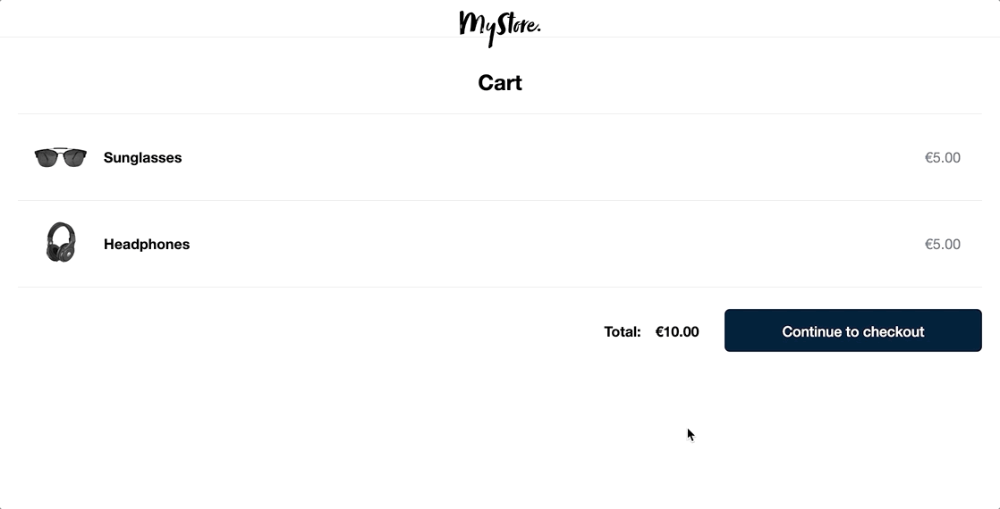

# Adyen [online payment](https://docs.adyen.com/online-payments) integration demos

## Run this integration in seconds using [Gitpod](https://gitpod.io/)

* Open your [Adyen Test Account](https://ca-test.adyen.com/ca/ca/overview/default.shtml) and create a set of [API keys](https://docs.adyen.com/user-management/how-to-get-the-api-key).
* Go to [gitpod account variables](https://gitpod.io/variables).
* Set the `ADYEN_API_KEY`, `REACT_APP_ADYEN_CLIENT_KEY`, `ADYEN_HMAC_KEY` and `ADYEN_MERCHANT_ACCOUNT variables`.
* Click the button below!

> Note: Notice the `REACT_APP_` prefix in the `REACT_APP_ADYEN_CLIENT_KEY`.

_NOTE: To allow the Adyen Drop-In and Components to load, you have to add `https://*.gitpod.io` as allowed origin for your chosen set of [API Credentials](https://ca-test.adyen.com/ca/ca/config/api_credentials_new.shtml)_

[](https://gitpod.io/#https://github.com/adyen-examples/adyen-react-online-payments)  
&nbsp;[First time with Gitpod?](https://github.com/adyen-examples/.github/blob/main/pages/gitpod-get-started.md)

## Details

This repository showcases a PCI-compliant integration of the [Sessions Flow](https://docs.adyen.com/online-payments/build-your-integration/additional-use-cases/), the default integration that we recommend for merchants. Explore this simplified e-commerce demo to discover the code, libraries and configuration you need to enable various payment options in your checkout experience.  



The demo leverages Adyen's API Library for Node.js ([GitHub](https://github.com/Adyen/adyen-node-api-library) | [Docs](https://docs.adyen.com/development-resources/libraries#javascript)) on the server side.

## Requirements

Node.js 12+

## Installation

1. Clone this repo:

```
git clone https://github.com/adyen-examples/adyen-react-online-payments.git
```

2. Navigate to the root directory and install dependencies:

```
npm install
```

## Usage

1. Create a `./.env` file with your [API key](https://docs.adyen.com/user-management/how-to-get-the-api-key), [Client Key](https://docs.adyen.com/user-management/client-side-authentication) - Remember to add `http://localhost:3000` as an origin for client key, and merchant account name (all credentials are in string format):

```
# server-side env variables
ADYEN_API_KEY="your_API_key_here"
ADYEN_MERCHANT_ACCOUNT="your_merchant_account_here"
ADYEN_HMAC_KEY=yourNotificationSetupHMACkey

# client-side env variables: using REACT_APP prefix to be included in the REACT build 
REACT_APP_ADYEN_CLIENT_KEY="your_client_key_here"
```

2. Build & Start the server:

This will create a React production build and start the express server

```
npm run server
```

3. Visit [http://localhost:8080/](http://localhost:8080/) to select an integration type.

To try out integrations with test card numbers and payment method details, see [Test card numbers](https://docs.adyen.com/development-resources/test-cards/test-card-numbers).

**Note**

The demo supports cancellation and refunds, processing the incoming [Adyen webhook notifications](https://docs.adyen.com/development-resources/webhooks). Make sure webhooks are enabled and processed (see below).

# Webhooks

Webhooks deliver asynchronous notifications about the payment status and other events that are important to receive and process. 
You can find more information about webhooks in [this blog post](https://www.adyen.com/knowledge-hub/consuming-webhooks).

### Webhook setup

In the Customer Area under the `Developers → Webhooks` section, [create](https://docs.adyen.com/development-resources/webhooks/#set-up-webhooks-in-your-customer-area) a new `Standard webhook`.

A good practice is to set up basic authentication, copy the generated HMAC Key and set it as an environment variable. The application will use this to verify the [HMAC signatures](https://docs.adyen.com/development-resources/webhooks/verify-hmac-signatures/).

Make sure the webhook is **enabled**, so it can receive notifications.

### Expose an endpoint

This demo provides a simple webhook implementation exposed at `/api/webhooks/notifications` that shows you how to receive, validate and consume the webhook payload.

### Test your webhook

The following webhooks `events` should be enabled:
* **AUTHORISATION**


To make sure that the Adyen platform can reach your application, we have written a [Webhooks Testing Guide](https://github.com/adyen-examples/.github/blob/main/pages/webhooks-testing.md)
that explores several options on how you can easily achieve this (e.g. running on localhost or cloud).

